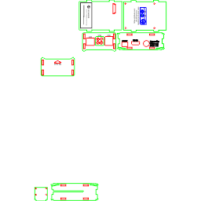

# 2F Scanner Build Instructions  
## Chigozie Aham  
## Table of Contents 
<ol>
<a href="#intro"><li>Introduction</li></a>
<a href="#items"><li>Items required</li></a>
<a href="#OS"><li>Installing Raspbian OS</li></a>
<a href="#opencv"><li>Installing OpenCV and Python</li></a>
<a href="#design"><li>Designing 2F Scanner:</li></a>
<a href="#v4l2"><li>Setting up V4L2 to enable video Recording</li></a>
<a href="#detection"><li>Facial detection</li></a>
<a href="#train"><li>Train the images</li></a>
<a href="#recog"><li>Facial Recognition</li></a>
</ol>

<h2 id="intro">Introduction:</h2>
2f Scanner is a device built with the Raspberry-pi 3 to perform the function of facial recognition for security purposes. It's an optional tool that could be used for biometric verification of a registered user in the android mobile application, GBMstats. OpenCV, which stands for Open Computer Vision, was utilized in performing facial detection and recognition. OpenCV is an open source library originally developed by Intel that contains functions focusing on real-time computer vision. For inclined technology students, It should take about 5-7 days to successfully complete these build instructions based on their commitment. 

<h2 id="items">Items Required:</h2>
•	Pi-camera 
•	Raspberry-pi 
•	HDMI adapter 
•	VGA – HDMI cable 
•	Laptop 
•	Monitor 
•	Mouse 
•	Keyboard 
•	MicroSD card 

<h2 id="OS">Installing Raspbian OS (Windows Users):</h2>
•	Download the Raspbian image from the website. This would take a long while: https://www.raspberrypi.org/downloads/raspbian/  
•	Download and install the SD card formatter for formatting the MicroSD card from: https://www.sdcard.org/downloads/formatter_4/  
•	Download and install the Windows image file reader from: http://sourceforge.net/projects/win32diskimager/  
•	Insert the MicroSD card into your Windows laptop, launch the SD Card Formatter and navigate to “Select Card”, choosing the right drive assigned to your MicroSD card, then “Quick Format” and Format the card.  
•	Launch the Win32 Disk Imager, choose the right ISO image file you downloaded and the right drive and select write. Wait a while and the ISO image file would be successfully written to your SD card.  
•	Next, insert the SD card into the raspberry pi. NOTE: Plug the keyboard, mouse and monitor into the raspberry pi first before powering it.  
•	Optionally, to use VNC viewer in controlling the raspberry pi remotely, you have to install VNC viewer on your laptop (https://www.realvnc.com/en/connect/download/viewer/). On your raspberry pi, navigate to the “Preferences”, and turn on the VNC. Next, launch the terminal on your raspberry-pi, use the command – ifconfig – to get your raspberry-pi IP address. After the VNC download is complete on your laptop, launch it. Navigate to the search box and enter your raspberry-pi IP address and hit the enter button.  

<h2 id="opencv">Installing OpenCV and Python:</h2>
•	Carefully follow the steps on the link: https://www.learnopencv.com/install-opencv3-on-ubuntu/  

<h2 id="design">Designing 2F Scanner</h2>
The pi-camera is a really fragile technology, so a case was required to protect it. Using CorelDraw and accurate <a href="https://www.raspberrypi-spy.co.uk/2013/05/pi-camera-module-mechanical-dimensions/">schematics</a>, a design was produced. Find below a preview of the design and link to download CorelDraw and the schematic: 
 
 
<a href="https://www.coreldraw.com/en/pages/free-download/">CorelDraw</a> 
<a href="https://github.com/goziethelegion/Legion/tree/master/Pi2CaseHumber">Schematics</a> 

<h2 id="v4l2">Setting up V4L2 to enable video Recording</h2>
The pi-camera is mainly designed for camera capture, so video recording is a quite complex. You would have to install V4L2 to enable video recording. Follow the steps below to successful install v4L2 and enable it.  

sudo apt-get install autoconf gettext libtool libjpeg62-dev 
cd v4l-utils 
autoreconf -vfi 
./configure 
make 
sudo make install 
 
sudo modprobe bcm2835-v4l2 

v4l2-ctl --overlay=1 # enable viewfinder 

v4l2-ctl --set-fmt-video=width=320,height=240,pixelformat=4 
v4l2-ctl --stream-mmap=3 --stream-count=100 --stream-to=somefile.264 

v4l2-ctl --set-fmt-video=width=320,height=240,pixelformat=3 
v4l2-ctl --stream-mmap=3 --stream-count=1 --stream-to=somefile.jpg 

v4l2-ctl --set-ctrl video_bitrate=10000000 

<h2 id="detection">Facial detection (Signing up user):</h2>
•	Open up the terminal, navigate to the Home>pi>VideoCam directory. 
•	Run the datasetter.py  
	python datasetter.py 
•	A prompt message would appear asking for your name 
•	After you enter your username, a live video frame would appear on the computer screen, recording. 
•	Hold up 2f scanner to enable capture of your face. 
•	Look into the camera so the camera could easily detect your face 
•	Ensure the background lighting is good. 
•	Tilt your head back and forth (preferably around) to enable the camera to capture all your facial angles. 
•	The video frame would only exit when 20 images has been successfully captured and stored in the dataset folder.  
#### Relevant files and link:
<ul>
<a href="https://github.com/goziethelegion/Legion/blob/master/datasetter.py"><li>datasetter.py</li></a>
<a href="https://github.com/goziethelegion/Legion/blob/master/haarcascade_frontalface_default.xml"><li>haarcascade_frontalface_default.xml</li></a>
</ul>

<h2 id="train">Train the images:</h2>
•	Next, train the images captured in the dataset folder by running the program trainer.py – 	python trainer.py 
#### Relevant files and link:
<ul>
<a href="https://github.com/goziethelegion/Legion/blob/master/trainer.py"><li>trainer.py</li></a>
<a href="https://github.com/goziethelegion/Legion/blob/master/haarcascade_frontalface_default.xml"><li>haarcascade_frontalface_default.xml</li></a> 
</ul>

<h2 id="recog">Facial Recognition:</h2>
•	Still in the same directory, run the program detector.py 
python detector.py 
•	Ensure the background lighting is good. 
•	Hold up 2f scanner to your face level and the camera should recognize your face with the name you entered on top of your picture frame. 
#### Relevant files and link:
<ul>
<a href="https://github.com/goziethelegion/Legion/blob/master/detector.py"><li>detector.py</li></a>
<a href="https://github.com/goziethelegion/Legion/blob/master/haarcascade_frontalface_default.xml"><li>haarcascade_frontalface_default.xml</li></a>
</ul>

